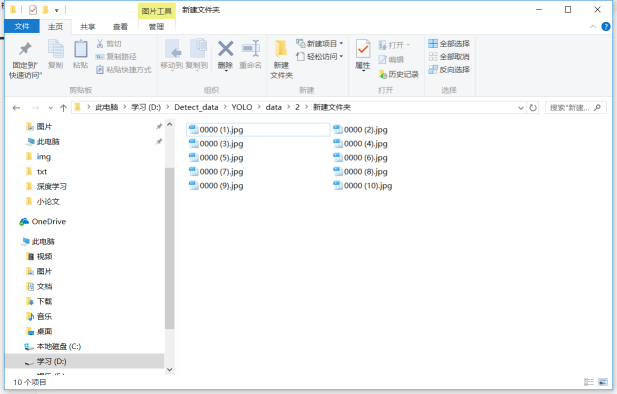

## 批量修改文件名

> 更新时间：2018.6.22
>
> 作者：PoetryWanderer

[TOC]

##### 1. 需求描述

​	当文件夹中含有大量文件时，你可能需要将其按照你需要的名称进行排列，这在深度学习数据集制作时经常用到。

​	现在，我们将10张图片批量改名为0000.jpg ... 0009.jpg

##### 2. 方法一

直接对所有文件进行重命名操作：

​	Ctrl+A选中所有文件，对其中一个文件名进行修改为0000.jpg，完成后点击回车，效果如下：

**缺点**：可以看出，这种方法是通过添加(1)、(2)、(3)...的形式进行批量修改的

##### 3. 方法二

1. 打开终端窗口，首先进入文件所在文件夹，再输入命令 dir /b>rename.xls，如下图所示，可将文件夹中的文件名在rename.xls文件中列出。

   

2. 随后你会发现文件夹中出现了一个新文件 rename.xls，打开后文件名以全部罗列在A列中，然后在任意列中输入x0000.jpg作为第一个文件文件名，采用自动填充方法填充剩余的

   **注意**：这里0000.jpg是无法进行自动填充的，因为填充时0001.jpg前会变成1.jpg，也就是前面的0会自动省略，因此我们在前面加一个x，后续再替换掉

   

3. 鼠标选中C1单元格，并在编辑框中输入公式="ren "&A1&" "&B1，并进行自动填充

      

4. 在记事本中，粘贴相应列，并使用替换操作将x0000.jpg改为0000.jpg，如下图示。

      

5. 将txt文件后缀改为.bat格式，双击，即可完成修改。

      