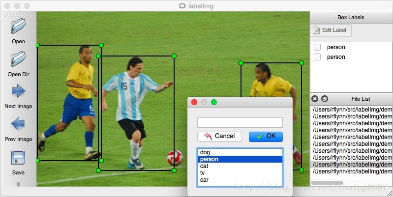
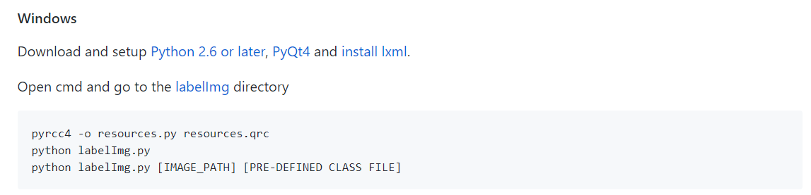

## labelImg 标注工具windows安装过程 (up-to-date)

> 更新时间：2018.6.21

####1.labelImg介绍：

LabelImg适用于图像检测任务的数据集制作： 
 

它来自下面的项目：<https://github.com/tzutalin/labelImg> 
其中标签存储功能和“Next Image”、“Prev Image”的设计使用起来比较方便。 
该软件最后保存的xml文件格式和ImageNet数据集是一样的。

####2.window10 安装过程

> 官方的安装过程：



> 安装过程中存在的问题：

1. 安装PyQt4：

   （1）现在官网发布的window的版本下载后是一个解压版，但不是直接可以用的，而且需要重新make安装，比较麻烦。 
   （2）常用的pip或者conda自动安装，并不会发现有针对windows平台的现成的资源存在。

   ​	即pip install 你会发现找不到相应文件

   解决：.whl文件下载地址：<http://www.lfd.uci.edu/~gohlke/pythonlibs/#pyqt4>

   ​	安装的时候，在其文件夹下直接pip install xxx.whl

2. 安装labelImg：

   ​	参照安装labelme的方法，直接pip install labelImg，虽然确实能够安装，但是安装的文件不是完整的，你会发现后续操作无法进行，正确方法如下：

   ​	项目官方网址下载后手动安装即可，

   ​	（项目官方地址：<https://github.com/tzutalin/labelImg>） 

3. python labelImg.py 出错：

   出现如下错误：TypeError: qRegisterResourceData(int, str, str, str): argument 2 has unexpected type 'str'

   **错误原因：**

   pyrcc默认生成的代码是Python2.x的，python3.x不兼容。

   **解决办法：**

   把编译命令后面加上-**py3** ，如

   ```python
   pyrcc4 -py3 -o resources.py resources.qrc
   ```


**参考链接**：

https://blog.csdn.net/u012654847/article/details/752289292

https://blog.csdn.net/vah101/article/details/6147602

   

   

   

   ​

   ​

   ​

   ​

   ​	

